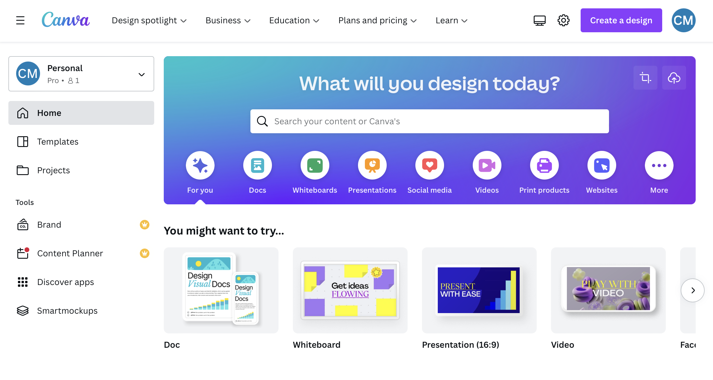
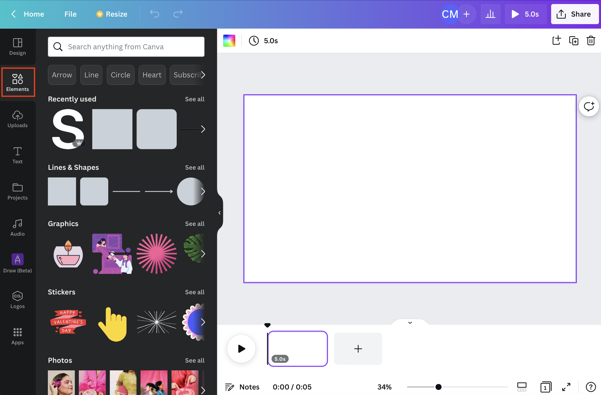
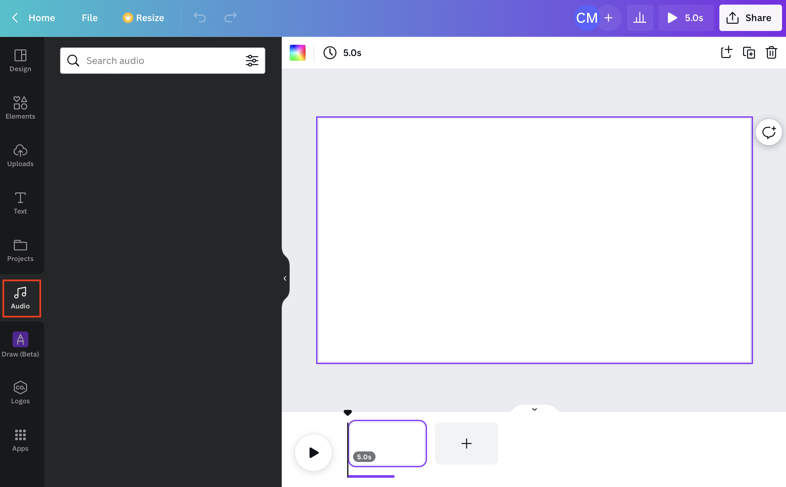
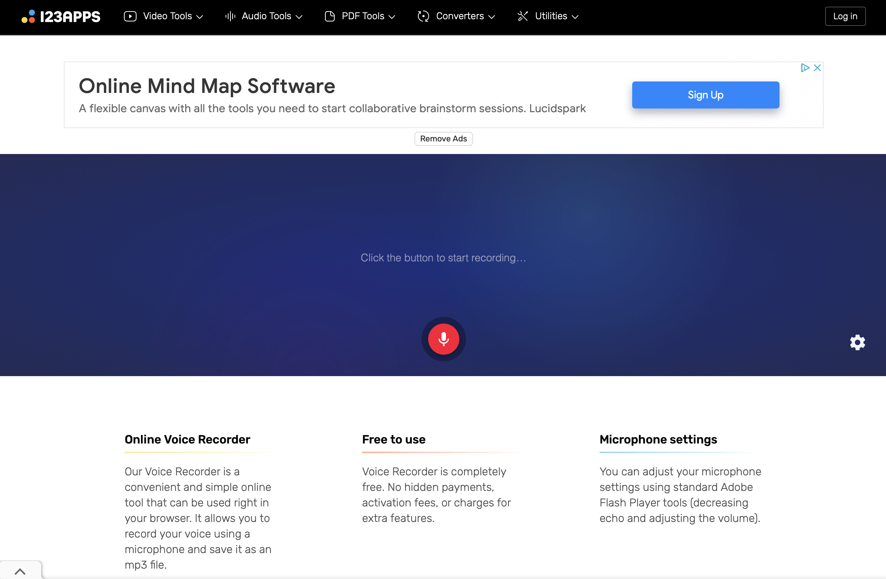
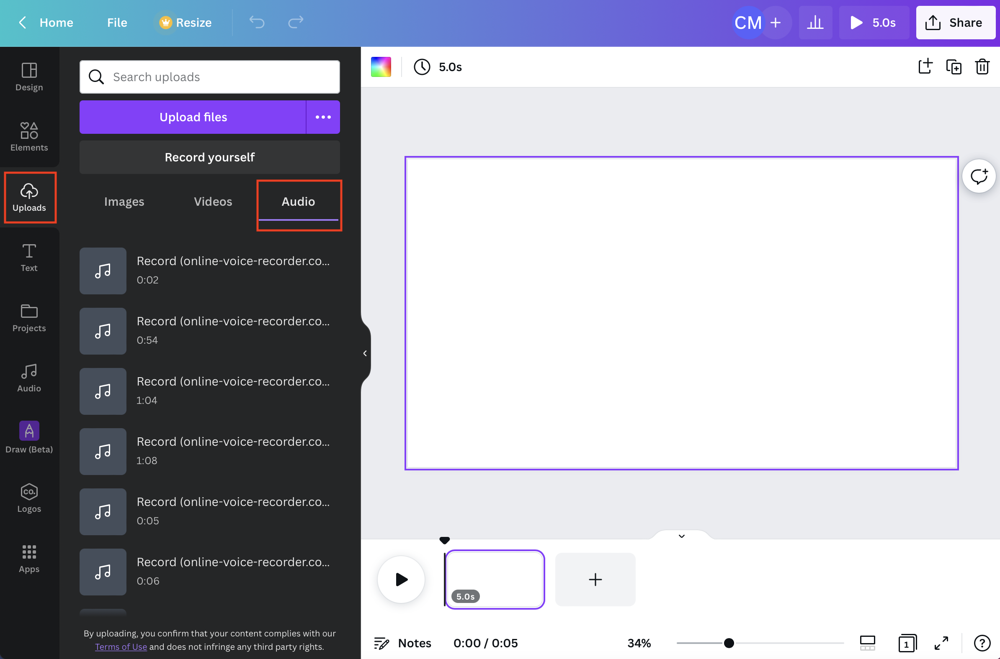
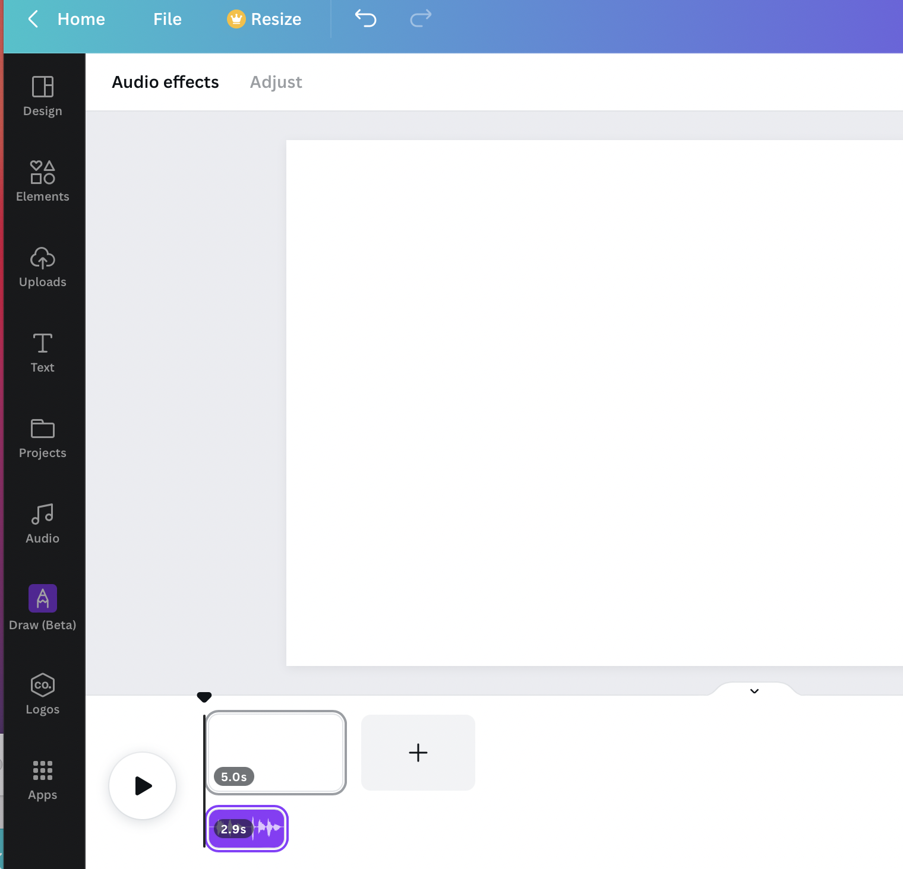
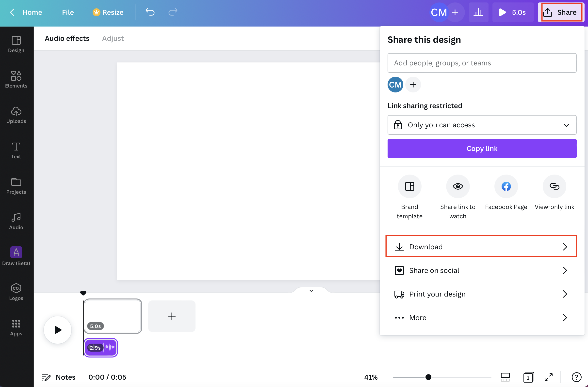

# Canva Video Instructions Tutorial for Gamifying Online Experiments

Tutorial for using [Canva](https://www.canva.com/education/) to create video instructions for tasks. This is a helpful tool for gamifying your tasks - the importance of task gamification for research is highlighted by [Long et al., 2023](https://www.nature.com/articles/d41586-023-00065-6)! 

This repository contains a contextual bandit task for studying multi-attribute reinforcement learning (RL). The task is designed to run locally in your browser, allowing for efficient and accessible experimentation.

## Overview

The **Contextual Bandit Task** is a behavioral paradigm created to explore multi-attribute decision-making using reinforcement learning principles. Participants are presented with choices that vary across multiple attributes, enabling the study of complex decision-making behaviors in a controlled setting.

## Getting Started

To run the task:

1. Clone this repository to your local machine.
2. Open `...\multiattribute_RL_task\index.html` in yor local browser. Note: This task is coded in JavaScript, so all functionality runs client-side within your browser.

File Structure:
`index.html`: Main HTML file to launch the task.
`static`: Folder containing images and custom plugins (JsPsych) necessary for creating and displaying task attributes.

Participants in this task will:
- Make decisions between options with multiple attributes (shape and color).
- Receive feedback based on their choices, simulating a reinforcement learning environment.
- Accumulate rewards over trials, allowing for analysis of multi-attribute learning and decision strategies.
   

**Creating gamified video instructions**
The **first step** is to create a free account by visiting [Canva](https://www.canva.com/education/). There is a 14-day free trial for Canva Pro which grants access to all site features. However, Canva Pro is *not* absolutely necessary for creating video instructions. 

**Next,** create a blank video by clicking on 'Video' from the available templates. 

Add and rearrange scenes by pressing the plus sign button: 

Add background images or avatars by navigating to the Elements tab and searching for your desired features:

Add sound effects and background music by navigating to the Audio tab and searching for your desired audio:

To add a voice recording of your instructions, you will need to record the audio externally. [Online Voice Recorder](https://online-voice-recorder.com/) is an easy and free site for recording mp3 files on your local device. 

Once you've recorded your instructions, import the mp3 files to Canva using the Uploads > Audio tab. You can also import your own images and/or video clips within the Uploads tab:

Drag and drop your audio files beneath the corresponding scene(s):

Once you are finished with your video, download it locally as an mp4 file by navigating to Share > Download. 

Note, it is important to consider principles of [Universal Design](https://www.washington.edu/doit/universal-design-process-principles-and-applications) (i.e., captioning your video or ensuring that a transcript is made available to participants) when creating task instructions so ensure accessibility.

**Example instruction video:** [Gem Hunters](https://drive.google.com/file/d/1OiVJyvNp0mrnBy_VhVCejjZ6tDUyZLLr/view?usp=sharing)

**Additional resources:**

[Creating and editing videos - Canva Help Center](https://www.canva.com/help/creating-and-editing-videos/)

[Create videos with Canva](https://www.canva.com/designschool/tutorials/video/) 

[Tips for conducting online studies (Hosting: Prolific, Recruiting: Pavlovia)](https://github.com/christinamaher/TipsOnlineExperiments)

